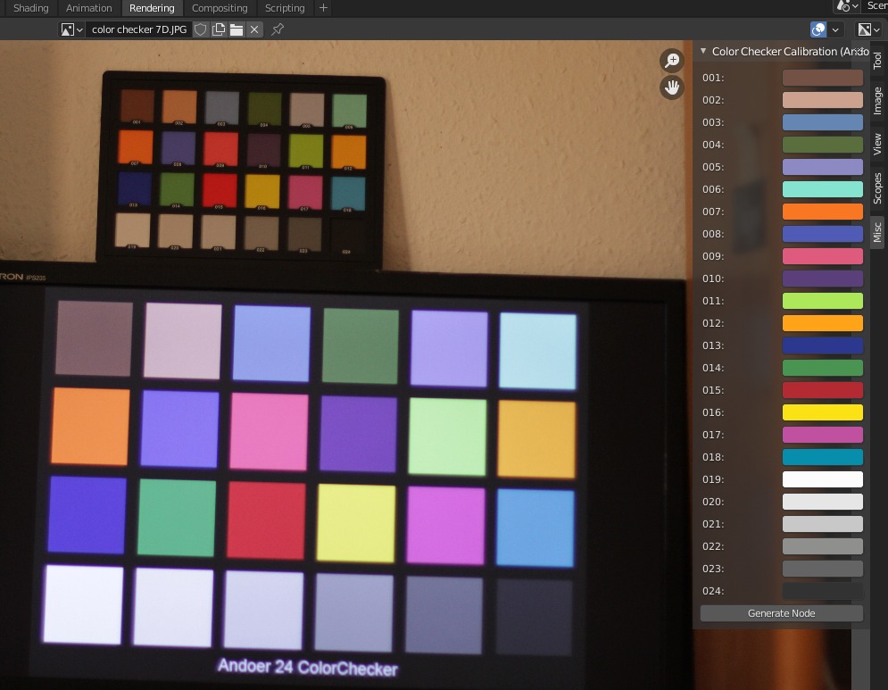

# Color Checker Calibrator
A Blender addon that can calibrate images to an Andoer Color Checker ($16)
## How to Use
Click on the Rendering Workspace
Open your image
N > Misc > Color Checker Calibration (Andoer)

On each color, use the pipette (eye dropper) to pick each color. This changes the color (true values are kept in the script though).

Once all the 24 are picked, click the "Generate Node" button in the panel to generate a hue correction node!

